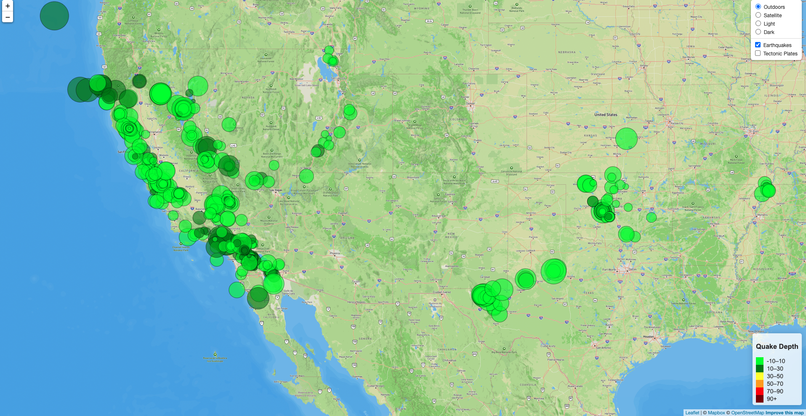
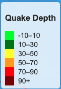
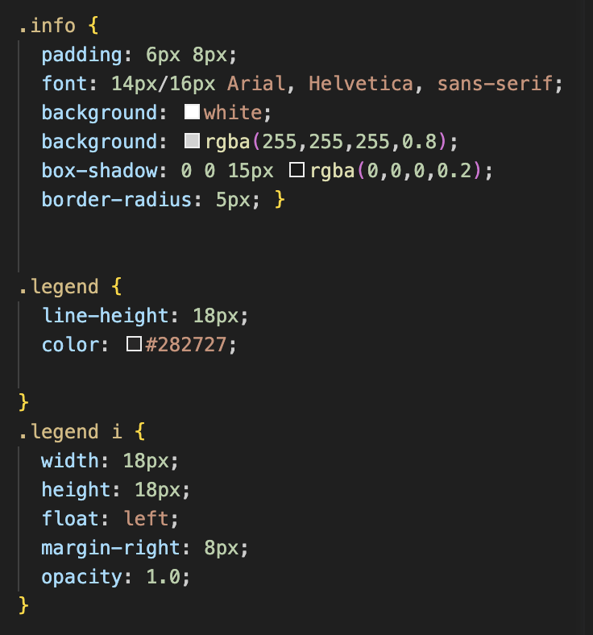
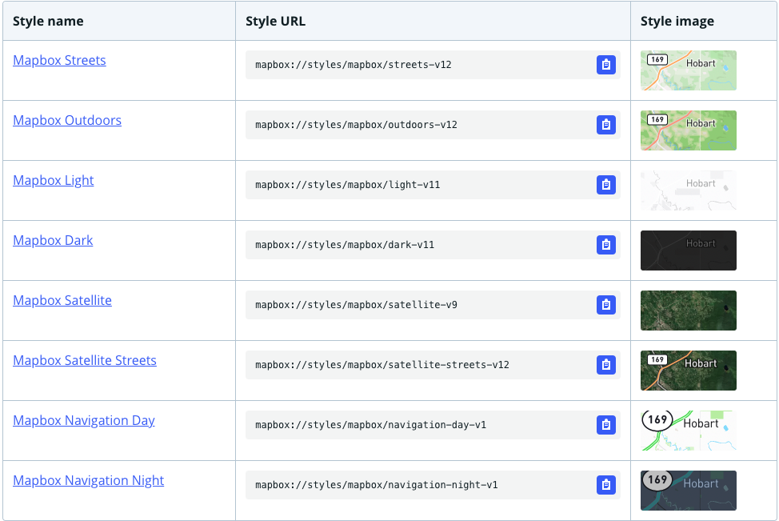
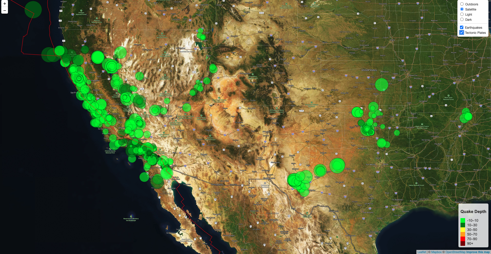

# Leaflet Challenge Assignment

## Background

The United States Geological Survey, or USGS for short, is responsible for providing scientific data about natural hazards, the health of our ecosystems and environment, and the impacts of climate and land-use change. Their scientists develop new methods and tools to supply timely, relevant, and useful information about the Earth and its processes.

The USGS is interested in building a new set of tools that will allow them to visualize their earthquake data. They collect a massive amount of data from all over the world each day, but they lack a meaningful way of displaying it. In this challenge, you have been tasked with developing a way to visualize USGS data that will allow them to better educate the public and other government organizations (and hopefully secure more funding) on issues facing our planet.

## Part 1: Create Earthquake Visualization

In order to visualize the USGS data, we needed to visit the USGS GeoJSON Feed (https://earthquake.usgs.gov/earthquakes/feed/v1.0/geojson.php) and choose a dataset to visualize.

I chose the "All Earthquakes from the Past 7 Days" dataset to pull for the visualization.

Using d3 and Leaflet, we create a map to plot all of the earthquakes where the size of circle marker related to the magnitude of the earthquake and the color related to the depth of the quake. We also created popups to show additional information about each quake when you clicked on the marker. Lastly, we created a legend to express the color coding we used to display the depth of each quake, also adapting the css file to create the expected legend.

## Part 2: Different Style Maps and Tectonic Plate Lines

For the second part, we needed to use different map styles, using Mapbox as our source. In order to access these styles, we needed to retrieve a public access token from mapbox for our API call.

Lastly, we pulled the raw data from a github repository that would allow us to embed the tectonic plate lines as a layer in our map. https://raw.githubusercontent.com/fraxen/tectonicplates/master/GeoJSON/PB2002_boundaries.json

Live Github Pages Deployment: https://jed-miller.github.io/leaflet-challenge/

